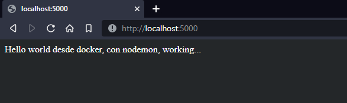
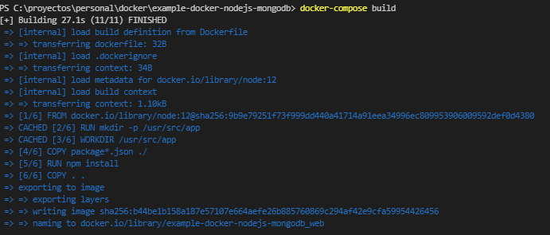
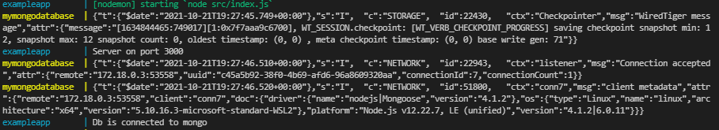

# INSTALACION DE IMAGENES DE DOCKER 
docker build -t hellonode .

# EJECUTAR LA IMAGEN CREADA
docker run -p 4000:3000 hellonode

# CREAR LAS IMAGENES DESDE DOCKER COMPOSE
docker-compose build

# EJECUTAR LAS  IMAGENES CREADAS
docker-compose up

# ENTRAR A LA CONSOLA DEL PROCESO
docker ps
docker exec -it exampleapp bash
# ls -a

# DETENER LOS SERVICIOS
docker-compose stop

